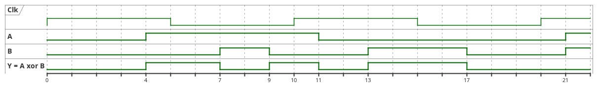
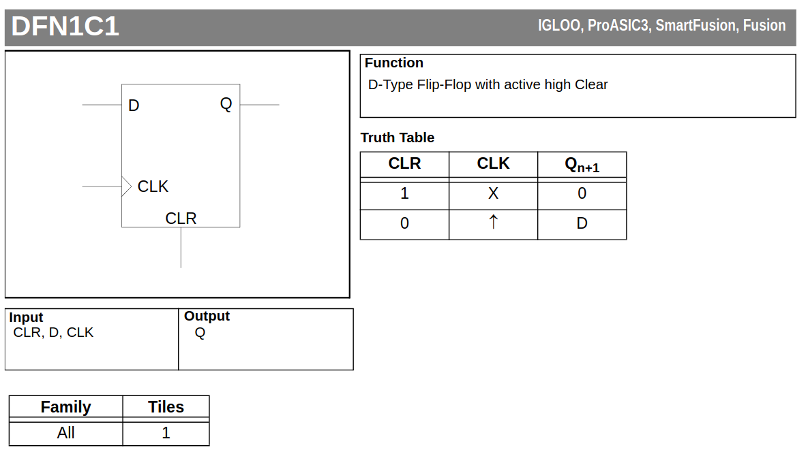
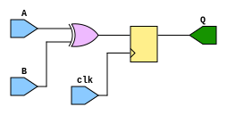
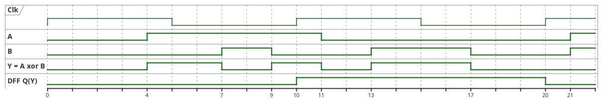
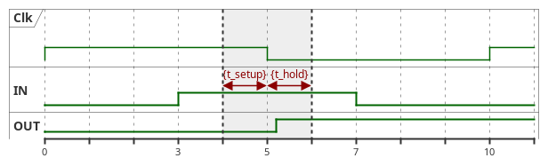
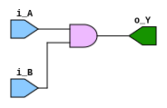
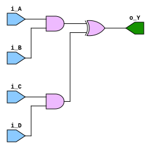
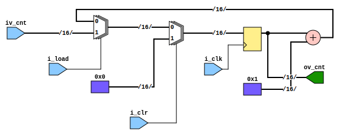
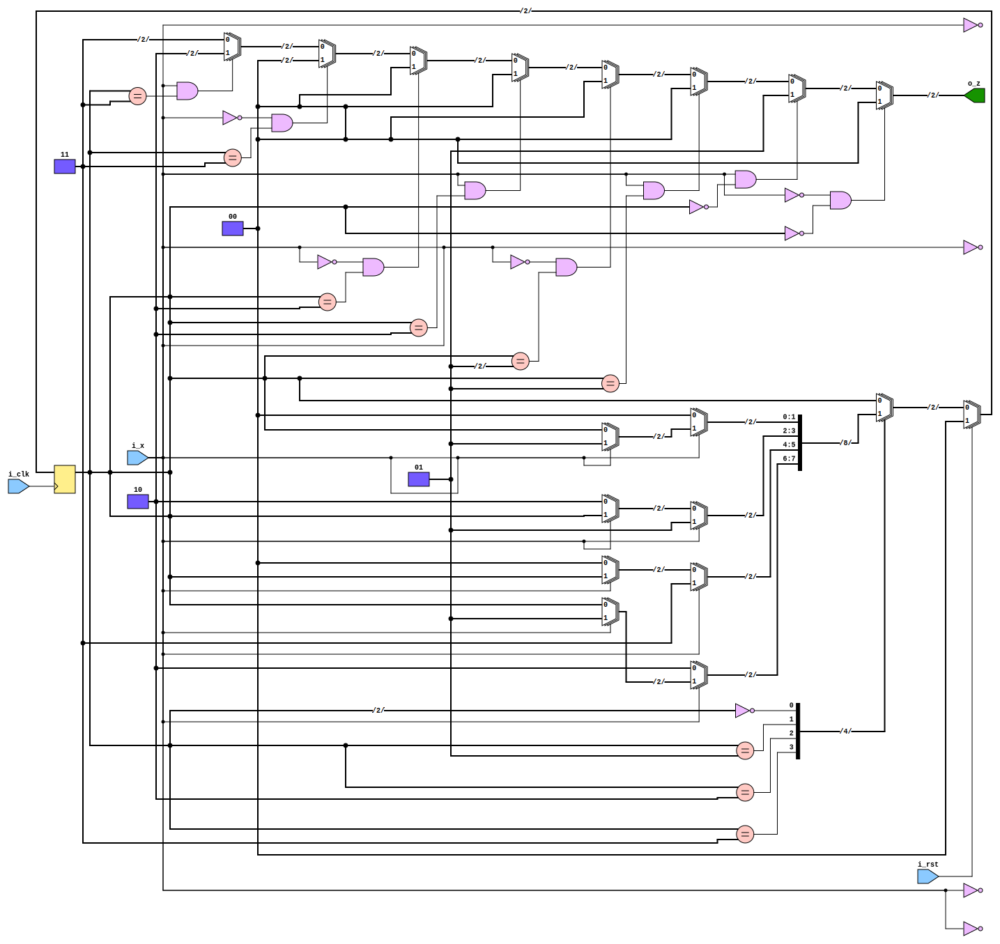
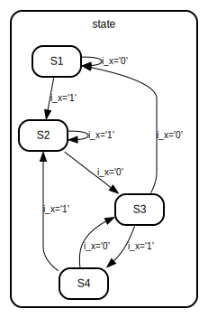

# Wprowadzenie do języków opisu sprzętu - VHDL

Języki opisu sprzętu na pierwszy rzut oka mogą w składni przypominać 
klasyczne języki programowania jak C czy Basic (będą też zazwyczaj wspierać
konstrukty pozwalająca na opis procedury realizującej algorytm matematyczny,
czy dostęp do plików). Ważna jest jednak świadomość, że nie do tego zostały 
stworzone i głównym ich zadaniem jest opisanie sprzetu zgodnie z intencjami 
projektanta. 

Sam opis może zostać zrealizowany na różnych poziomie abstrakcji. Przykładowo
operacja dodawania może zostać opisana bezpośrednio na bramkach logicznych 
(n-bitowy ciąg XOR) lub przy użyciu operatora `+` działającego na wektorach 
bitowych. 

`Verilog` (plus `SystemVerilog`) oraz `VHDL` są najczęściej używanymi jezykami 
opisu sprzętu. Często są też jednymi wspieranymi przez narzędzia dostarczone
przez producenta układu FPGA. Zarówno Verilog jak i HDL doczekały się
wersji (rozwinięcia) z dopiskiem `-AMS`: odpowiednio `Verilog-AMS`, `VHDL-AMS`. 
Rozwinięcie AMS - Analog and Mixed Signals. Na potrzeby zajęć skupimy się 
na wersjach podstawowych, ponieważ będziemy pracować jedynie z układami 
cyfrowymi możliwymi do realizacji w standardowych układach FPGA.

# Dwuelementowa Algebra Boola
Dwuelementowa algebra Boola to specjalny typ ogólne Algebry Boola, która 
ma tylko dwa elementy `0` oraz `1`. Wartości `0` oraz `1` można określić 
jako stany logiczne, `0` - logiczne zero/fałsz, `1` - logiczna jedynka/prawda.
Układy cyfrowe, w których podstawowe układy są układami przełączającymi 
pomiędzy stanami niskiego oraz wysokiego napięcia (przykładowo logika 
CMOS) można łatwo powiązać do dwuelementowej algebry Boola i sprowadzić 
projektowanie do opisu algorytmów realizowanych w tej algebrze.

Grafika poniżej przedstawia zestaw podstawowych komórek logiki Bool'a. 
Używając tylko tych elementów jesteśmy w stanie zrealizować bardzo skomplikowane 
operacje, przykładowo mnożenie wielo-bitowych wektorów. 


Tablica prawdy dla komórki OR:
| In_A | in_B | Out |
|------|------|-----|
| 0    | 0    | 0   |
| 0    | 1    | 1   |
| 1    | 0    | 1   |
| 1    | 1    | 1   |

Tablica prawdy dla komórki AND:
| In_A | in_B | Out |
|------|------|-----|
| 0    | 0    | 0   |
| 0    | 1    | 0   |
| 1    | 0    | 0   |
| 1    | 1    | 1   |

Tablica prawdy dla komórki XOR:
| In_A | in_B | Out |
|------|------|-----|
| 0    | 0    | 0   |
| 0    | 1    | 1   |
| 1    | 0    | 1   |
| 1    | 1    | 0   |

# Logika kombinacyjna
Logika kombinacyjna to taka, której stan (na wyjściu) zależy jedynie 
od stanu na wejściu. Wszystkie bramki logiki Boola (oraz ich dowolne, 
nawet wieloelementowe kombinacje) będą zaliczone do logiki kombinacyjnej.

Bloki, dalej uważane za podstawowe, które można zrealizować na używając
podstawowych komórek z logiki boola:

    - komutatory:
        * multiplexery (N:1, N - wejście -> 1 wyjście)
        * demultiplexer (1:N, 1 - wejście -> 1 z N wyjście)
    - dekodery, kodery
    - bloki arytmetyczne:
        * sumatory
        * komparatory
        * inne

Diagram poniżej przedstawia przebieg czasowy komórki XOR (Y = A xor B). 
Przebieg jest uproszczony poniewaz nie okazuje opóźnienia (czasu propagacji)
samej komórki, jednak jest wystarczający do zobrazowania różnicy.
Na diagramie został zaznaczony także zegar z okresem 10 jednostek czasu.
Jak widać, stan wyjścia Y zmienia się bezpośrednio przy każdej zmianie 
stanu na wejściu A lub B.




# Logika sekwencyjna
Logika sekwencyjna to taka, której stan (na wyjściu) zależy od od stanu na 
wejściach oraz od aktualnego ***stanu***. Stan aktualny musi zostać zapamiętany
- będę służyły do tego elementy takie jak zatrzask (and. latch) lub rejestr. 

Logika sekwencyjna może pracować synchronicznie do zegara - wówczas będzie 
określana jako logika synchroniczna. Przy braku zegara praca będzie asynchroniczna, 
stąd nazwa - logika asynchroniczna. 

Na potrzeby zajęć będziemy zajmować się głównie logiką synchroniczną. 

Najprostszym elementem logiki synchronicznej jest rejestr - element zapamiętujący.
Przełączenie odbywa się jedynie w czasie zbocza zegarowego (najczęściej zbocze 
narastające).



Bardzo prosty przykład logiki kombinacyjnej osiągniemy po podłączeniu
wyjścia z bramki XOR na wejście bramki DFF.





# Zależności czasowe
Temat zależności czasowych (ang. *timings*) jest jednym
z kluczowych aspektów projektowania układów FPGA. Poniżej 
znajduje się jedynie kilka zdań wprowadzenia, w celu zarysowania tematu.

Każdy układ zrealizowany w sprzęcie będzie charakteryzował się większym od zera czasem odpowiedzi
(czasem propagacji) - tj. czasem potrzebnym na pojawienie
się stabilnej odpowiedzi na wyjściu układu po zmianie stanu na wejściu. Przykładowo, podstawowa bramka logiczna XOR zrealizowana w jednej ze starszych technologii może charakteryzować się czasem odpowiedzi na poziomie 1ns. 
Przyjmuje się, że w tym czasie stan wyjścia jest niestabilny, tj. nieustalony.

Kolejne opóźnienia wprowadzają połączenia pomiedzy 
elementami układu, które będą zależeć od obciążenia
widocznego na wyjściu elementu sterującego dany punkt.

Dla Układów działających synchronicznie (sekwencyjnie) - 
np. przerzutniki D (DFF), które przełączają stan na zboczu zegara, 
producenci podają dwa bardzo ważne parametry:

  - setup time - minimalny czas przed zboczem zegarowym,
    wejście układu musi utrzymać stabilny stan/wartość;
  - hold time - minimalny czas po zboczu zegarowym,
    wejście układu musi utrzymać stabilny stan/wartość.



Naruszenie warunków na czas setup lub hold (zmiana stanu sygnały 
wejściowego z szarym obszarze na diagramie wyżej) może doprowadzić 
do pojawienia się stanu nieustalonego na wyjściu przerzutnika
i w konsekwencji złego działania całego układu.


# VHDL - VHSIC Hardware Description Language
`VHDL` (podobnie jak `Verilog`) jest językiem, którego kolejne wersje są 
opracowywane przez komitet standaryzujący IEEE. `VHDL` jest określany jako 
tzw. "strongly typed" tj. jest wymusza na projektancie dokładne zdefiniowanie 
typu każdej zmiennej/sygnały. 

`VHDL` jest mniej popularny niż `Verilog`, ale jest językiem używanym
w projektach Europejskiej Agencji Kosmicznej, stąd to własnie na nim skupimy 
się na zajęciach.

Kolejne wydania `VHDL` oznaczane są rokiem wprowadzenie standardu opisującego 
daną wersję. Najbardziej istotne będą wydania 1995 i 2008. Ostatnie oficjalne 
wydanie jest z roku 2019. 

Podobnie jak w przypadku C++, symulatory oraz syntezatory `VHDL` wprowadzają 
wsparcie dla kolejnych wydaj z dużym opóźnienie. Większość narzędzi komercyjnych 
oraz open-source wspiera kluczowe elementy standardu 2008. Rewizja 2019 jest
jest wspierana głównie w narzędziach komercyjnych (przykładowo Xilinx Vivado), 
ale nawet wówczas w ograniczonym zakresie.

`VHDL` jest językiem, który nie rozróżnia wielkości liter w składni 
(case insensitive) (uwaga, zaleca się używania konsekwentnie dużych 
lub małych liter, jeżeli sam `VHDL` nie rozróżni sygnałów `i_in` oraz 
`i_IN` to, zdarzały się przypadki, gdzie narzędzia syntezy kopiowały 
nazwy bezpośrednio z VHDL do innego języka opisującego układ po syntezie 
co powodowało problemy na kolejnych etapach generacji projektu).

**Uwaga:** VHDL jako język wspiera konstrukcje, które nie mogą zostać przeniesione w sprzęt, przykładowo 
dostep do plików przez system plików systemu operacyjnego, operacje wait (z czasem podanym w pochodnych sekundy). Moduły poprawnie opisujące sprzęt 
będą określane jako tzw. syntezowalne, pozostały 
kod trafi do kategorii niesyntezowalnego. 

# VHDL - Słowa kluczowe
Tabelka poniżej wypisuje słowa kluczowe języka `VHDL`. Te najbardziej kluczowe 
zostaną użyte w przykładach poniżej. Zainteresowanych definicjami pozostałych 
odsyłam do standardu

| abs             |   case           |   generate  |   map     |   package    |   select     |   unaffected  |
|-----------------|------------------|-------------|-----------|--------------|--------------|---------------|
|   access        |   component      |   generic   |   mod     |   port       |   severity   |   units       |
|   after         |   configuration  |   group     |           |   postponed  |   signal     |   until       |
|   alias         |   constant       |   guarded   |   nand    |   procedure  |   shared     |   use         |
|   all           |                  |             |   new     |   process    |   sla        |               |
|   and           |   disconnect     |   if        |   next    |   pure       |   sll        |   variable    |
|   architecture  |   downto         |   impure    |   nor     |              |   sra        |               |
|   array         |                  |   in        |   not     |   range      |   srl        |   wait        |
|   assert        |   else           |   inertial  |   null    |   record     |   subtype    |   when        |
|   attribute     |   elsif          |   inout     |           |   register   |              |   while       |
|                 |   end            |   is        |   of      |   reject     |   then       |   with        |
|   begin         |   entity         |             |   on      |   rem        |   to         |               |
|   block         |   exit           |   label     |   open    |   report     |   transport  |   xnor        |
|   body          |                  |   library   |   or      |   return     |   type       |   xor         |
|   buffer        |   file           |   linkage   |   others  |   rol        |              |               |
|   bus           |   for            |   literal   |   out     |   ror        |              |               |
|                 |   function       |   loop      |           |              |              |               |

## Jednostki projektowe ##
Jednostki projektowe (ang. *design units*) stanowią podstawowe bloki konstrukcyjne, które pozwalają na strukturalne i hierarchiczne opisanie projektowanego modułu. W ramach jeżyka VHDL wyróżniamy pięć kluczowych typów jednostek projektowych:

### Entity
Entity definiuje zewnętrzne interfejsy modułu, opisując jego porty oraz parametry. Jest to pierwsza z jednostek projektowych, która precyzuje, jakie sygnały będą wchodzić do modułu i wychodzić z niego (słowa kluczowe `in`, `out` oraz `inout` przy deklaracji portów). Entity określa jedynie strukturę interfejsu, nie zawiera logiki działania.

```vhdl
entity cnt IS
    generic (
        G_BITS      : integer := 16
    );
    port (
        i_clk       : IN  std_logic;
        ov_cnt      : OUT  std_logic_vector (G_BITS-1 downto 0)
    );
end cnt;
```

Entity pozwala na zadeklarowanie portów (blok `port ()`) oraz parametrów konfiguracyjnych (blok `generic ()`). Parametry `generic` można porównać do stałych w makrach preprocesora w języku C/C++.

### Architecture
Architektura opisuje zachowanie lub strukturę modułu zdefiniowanego w entity. Jest powiązana z jednostką entity i może występować w kilku wariantach (np. strukturalna, behawioralna). VHDL pozwala na zdefiniowanie więcej niż jednej architektury dla jednego entity (wybranie architektury ma miejsce przy instancjonowaniu entity lub w konfiguracji). 

Przykładowa architektur dla entity `cnt` z sekcji poprzedniej:

```vhdl
architecture arch of cnt is
    signal tmp : unsigned(G_BITS-1 dowtno 0);
begin 

    proc: process(i_clk)
    begin
        if rising_edge(i_clk) then 
            tmp <= tmp + 1;
        end if;
    end process;

    ov_cnt <= std_logic_vector(tmp);
end architecture;
```

### Package
Pakiet służy do grupowania wspólnych deklaracji, takich jak typy danych, stałe, funkcje i procedury, które mogą być wykorzystywane w wielu jednostkach projektowych. Dzięki temu kod staje się bardziej modularny i czytelny.

```
package my_pkg is 
     
     type my_type is : ....;
end my_pkg
```

### Package body
Package body zawiera implementację elementów zadeklarowanych w pakiecie, takich jak ciała funkcji czy procedur. Nie wszystkie elementy muszą być definiowane w package body (np. stałe mogą być w pełni zdefiniowane w samym pakiecie).

```
package body my_pkg is 
     
     function ....;
end my_pkg
```

### Configuration
Konfiguracja pozwala na powiązanie konkretnej architektury z jednostką entity oraz określenie szczegółów hierarchii w przypadku złożonych projektów.

Konfiguracja są najrzadziej używaną jednostką projektową (niektóre narzędzia syntezy mogą nie 
oferowac wsparcia dla konfiguracji)

## Poziomy abstrakcji 
VHDL pozwala na opisanie projektowanego układu na różnych poziomach abstrakcji. Najczęściej wymieniane
(od wyższego do niższego):

- Opis behawioralny: opis operacji (matematycznych logicznych), zależności czasowych (zbocza zegarowe) oraz algorytmów
- opis RTL: skupienie na przepływie danych pomiędzy rejestrami w układzie
- opis strukturalny: opisanie struktury projektowanego układu na poziomie bloków oraz połączeń pomiędzy, tzw. netlista.

## Sygnały (signals)**
Sygnały to podstawowe obiekty w VHDL, które służą do przechowywania i przesyłania wartości, tj. sygnały moga opisywać przerzutniki, ale też połączenie pomiędzy modułami/bramkami. Sygnały są wykorzystywane do komunikacji między różnymi jednostkami projektowymi, takimi jak procesy, moduły czy komponenty.

W symulacji wartość sygnału jest aktualizowana z pewnym opóźnieniem (tzw. czas propagacji lub delta czasowa) podczas symulacji, co różni je od zmiennych.

```vhdl
signal nazwa_sygnalu : typ_danych := wartość_początkowa;
```

- `nazwa_sygnalu`: Nazwa sygnału.
- `typ_danych`: Typ danych sygnału, np. std_logic, std_logic_vector, integer.
- `wartość_początkowa` (opcjonalne): Wartość, jaką sygnał przyjmuje na początku symulacji.

Przykładowo:

```vhdl
architecture arch of entity1 is
    signal sig_wire : std_logic;
    signal sig_reg  : std_logic;
begin 

    proc: process(clk)
    begin 
        sig_reg <= sig_wire;
    end process;
    
    inst_and: AND_GATE
    port map(IN_A => A, IN_B => B, OUT => sig_reg);

end architecture;
```

Sygnał `sig_reg` realizuje połączenie (drut) pomiędzy 
bramką AND_GATE oraz rejestrem. Rejestr jest z kolei
zrealizowany w sygnale `sig_reg`.

## Procesy (process)**

Proces pozwala na zamknięcie w bloku kodu, którego instrukcje wykonywane będą sekwencyjnie (jedna po drugiej). W ramach jednej architektury możemy zdefiniowac wiele procesów i wszystkie działają współbieżnie (tzw. concurrent). 

```vhdl
etykieta: process (lista_wrażliwościowa)
begin
    -- instrukcja sekwencyjna 1
    -- instrukcja sekwencyjna 2
    -- instrukcja sekwencyjna 3
    -- ...
end process;
```

- etykieta: (opcjonalna) nazwa procesu
- lista_Wrażliwości: (opcjonalna) lista sygnałów, których zmiana aktywuje (budzi) process

Jeżeli process nie posiada listy wrażliwościowej, zostanie wywołany na początku symulacji. Sterowanie dalszym działaniem wymaga użycia instrukcji `wait`. 
Procesy takie są używane głównie przy testowaniu 
i są przykładem konstruktu, który nie będzie syntezowalny.

```vhdl
process
begin
    -- zaczekajmy na zbocze zegara
    wait until clk'event and clk = '1';
    counter <= counter + 1;
    -- zaczekajmy 10 ns
    -- wait for 10ns;
end process;
```
Po ostatniej instrukcji, process zacznie się wykonywać od nowa. Zablokowanie może nastąpić przez wstawienie instrukcji `wait` (nez argumentu -> efektywanie czekanie w nieskończoność).

Tylko w procesach możemy używać wysoko-poziomowych (jak na jezy opisu sprzętu) konstruktów, jak np. 

Instrukcje warunkowe:
```vhdl
if a = '1' then
    y <= '1';
else
    y <= '0';
end if;
```

Case/switch:
```vhdl
case selector is
    when "00" => y <= a;
    when "01" => y <= b;
    when others => y <= '0';
end case;
```

Pętle:
```vhdl
for i in 0 to 7 loop
    y(i) <= not x(i);
end loop;
```

## Podstawowe typy danych ##

### Typy skalarne (Scalar types)
- bit: reprezentuje binarne wartości 0 i 1.
```vhdl
    signal my_bit : bit := '0';
```
- std_logic : Najczęściej używany typ (wymaga wczytania pakietu z biblioteki standardowej), może przyjmowac jedną z wartości:
    * 'U': niezainicjowany,
    * 'X': nieznany,
    * '0': logiczne zero,
    * '1': logiczna jedynka,
    * 'Z': stan wysokiej impedancji,
    * 'W': słaba jedynka,
    * 'L': słabe zero,
    * '-': wartość "dowolna".
    Przykład:
```vhdl
    signal clk : std_logic := '1';
```

- integer: liczby całkowite z zakresem domyślnym od -2^31 do 2^31-1 (64bitowy w VHDL-2019)
```vhdl
    signal counter : integer range 0 to 255 := 0;
```
real: liczby zmiennoprzecinkoww
```vhdl
    signal voltage : real := 3.3;
```

- boolean: wartości logiczne: TRUE i FALSE.
```vhdl
    signal flag : boolean := TRUE;
```

- character: pojedyncze znaki ASCII.
```vhdl
    signal letter : character := 'A';
```

### Typy złożone (Composite types) ###

Typy złożone pozwalają grupować wartości.

- std_logic_vector: tablica/wektor wartości std_logic
```
    signal data : std_logic_vector(7 downto 0) := "00000000";
```
Indeksowanie można zdefiniować od lewej do prawej (`downto`) lub prawej do levej (`to`), standardowo używa się indeksowanie z `downto`.

- bit_vector: tablica/wektor wartości typu bit.
```vhdl
    signal addr : bit_vector(3 downto 0) := "1010";
```

- tablice: pozwalają na definiowanie własnych struktur danych, np. tablic jedno- lub wielowymiarowych.
```vhdl
    type memory_array is array (0 to 255) of std_logic_vector(7 downto 0);
    signal memory : memory_array;
```

- rekordy (records): służą do grupowania różnych typów danych w jedną strukturę.
```vhdl
    type rgb is record
        red   : std_logic_vector(7 downto 0);
        green : std_logic_vector(7 downto 0);
        blue  : std_logic_vector(7 downto 0);
    end record;
    signal pixel : rgb;
```
- typy wyliczeniowe (enumerated types)
```vhdl
type state_type is (IDLE, READ, WRITE);
signal state : state_type := IDLE;
```

- typy fizyczne (Physical types) (np typ `time`)
```vhdl
    signal delay : time := 10 ns;
```

## Instancjonowanie modułu (entity)
Instancjonowanie moduły to process umieszczania w naszym projekcie (hierarchicznie) innych komponentów (entity). Komponenty te mogą pochodzić z bibliotek technologicznych, zewnętrznych bibliotek lub byc zdefiniowane przez użytkownika. 

```vhdl
architecture arch of component1 is
    signal a1, b1, y1 : std_logic;
    signal a2, b2, y2 : std_logic;
begin
   
    inst_and_gate_1 : and_gate
        port map (
            a => a1,
            b => b1,
            y => y1
        );

    inst_and_gate_2 : and_gate
        port map (
            a => a2,
            b => b2,
            y => y2
        );
end structure;
```

W przykładzie wyżej, `and_gate` to nazwa komponentu (entity) umieszczanego w naszej architekturze. Instancjonowany moduł musi być widoczny w architekturze. Deklaracja komponentu musi zostac umieszczona we wczytanym pakiecie lub w architekturze.

```vhdl
architecture arch of component1 is

    component and_gate is 
    port map (
        a : in std_logic;
        b : in std_logic;
        y : out std_logic
    );
    end component;

    signal a1, b1, y1 : std_logic;
    signal a2, b2, y2 : std_logic;
begin
   
    inst_and_gate_1 : and_gate
        port map (
            a => a1,
            b => b1,
            y => y1
        );
end structure;
```

# VHDL - Przykłady 

## Przykłady opisu logiki kombinacyjnej

### Bramka AND

```vhdl
library ieee;
use ieee.std_logic_1164.all;

entity and_gate is
    port(
        i_A     : in std_logic;
        i_B     : in std_logic;
        o_Y     : out std_logic
    );
end entity;

architecture behavioral of and_gate is
begin
    o_Y <= i_A and i_B;
end architecture;
```



### Bramka z 4 wejściami 1-bitowymi 

Poniżej przedstawimy dwa sposoby opisu logiki kombinacyjnej realizującej funkcję:
`Y = (A and B) xor (C and D)`

1. Bezpośrednio w architekturze

```vhdl
library ieee;
use ieee.std_logic_1164.all;

entity logic4 is
    port(
        i_A     : in std_logic;
        i_B     : in std_logic;
        i_C     : in std_logic;
        i_D     : in std_logic;
        o_Y     : out std_logic
    );
end entity;

architecture behavioral of logic4 is
begin
    o_Y <= (i_A and i_B) xor (i_C and i_D);
end architecture;
```

2. W procesie

```vhdl
library ieee;
use ieee.std_logic_1164.all;

entity logic4_proc is
    port(
        i_A     : in std_logic;
        i_B     : in std_logic;
        i_C     : in std_logic;
        i_D     : in std_logic;
        o_Y     : out std_logic
    );
end entity;

architecture behavioral of logic4_proc is
begin
    proc_comb: process(i_A, i_B, i_C, i_D)
    begin
        o_Y <= (i_A and i_B) xor (i_C and i_D);
    end process;
end architecture;
```
W obu przypadkach narzędzie wyjście z narzędzie syntezy jest dokładnie takie samo:



## Przykłady opisu logiki kombinacyjnej

### 16-bitowy rejestr

```vhdl
LIBRARY IEEE;
USE IEEE.STD_LOGIC_1164.ALL;

ENTITY reg16 IS
    PORT (
        i_clk       : IN  std_logic;
        i_clr       : IN  std_logic;
        i_int       : IN  std_logic_vector(15 downto 0);
        o_out       : OUT std_logic_vector(15 downto 0)
    );
END cnt;

ARCHITECTURE behavioral OF reg16 IS
BEGIN
    P_MAIN: PROCESS(i_clk)
    BEGIN
        IF rising_edge(i_clk) THEN
            IF i_clr = '1' THEN
                o_out <= (others => '0');
            ELSE
                o_out <= i_int;
            END IF;
        END IF;
    END PROCESS;
END behavioral;
```

### Licznik

```vhdl
LIBRARY IEEE;
USE IEEE.STD_LOGIC_1164.ALL;
USE IEEE.NUMERIC_STD.ALL;

ENTITY cnt IS
    GENERIC (
        G_DATA_WIDTH        : integer := 16
    );
    PORT (
        i_clk               : IN  std_logic;
        i_clr               : IN  std_logic;
        i_load              : IN  std_logic;
        iv_cnt              : IN  std_logic_vector (G_DATA_WIDTH-1 DOWNTO 0);
        ov_cnt              : OUT  std_logic_vector (G_DATA_WIDTH-1 DOWNTO 0)
    );
END cnt;

ARCHITECTURE behavioral OF cnt IS
    SIGNAL cnt_int  : unsigned (G_DATA_WIDTH-1 DOWNTO 0) := (OTHERS => '0');
BEGIN
 
    P_MAIN: PROCESS(i_clk)
    BEGIN
        IF rising_edge(i_clk) THEN
            IF i_clr = '1' THEN
                cnt_int <= (others => '0');
            ELSE
                IF i_load = '1' then 
                    cnt_int <= unsigned(iv_cnt);
                ELSE
                    cnt_int <= cnt_int + 1;
                END IF;
            END IF;
        END IF;
    END PROCESS;
    ov_cnt <= std_logic_Vector(cnt_int); 
END behavioral;
    
```




### Maszyny stanu

```vhdl
library ieee;
use ieee.std_logic_1164.all;

entity fsm is
    port (
        i_clk, i_rst, i_x: in std_logic;
        o_z : out std_logic_vector(1 downto 0)
    );
end entity;

architecture arch of fsm is

    type t_state is (S1, S2, S3, S4);
    signal state: t_state;

begin

    proc_fsm: process (i_clk)
        begin

        if rising_edge(i_clk) then
            if i_rst='1' then
                state <= S1;
            else
                case state is
                    when S1 =>
                        if i_x='0' then
                            state <= S1;
                        elsif i_x='1' then
                            state <= S2;
                        end if;
                    when S2 =>
                        if i_x='1' then
                            state <= S2;
                        elsif i_x='0' then
                            state <= S3;
                        end if;
                    when S3 =>
                        if i_x='1' then
                            state <= S4;
                        elsif i_x='0' then
                            state <= S1;
                        end if;
                    when S4 =>
                        if i_x='0' then
                            state <= S3;
                        elsif i_x='1' then
                            state <= S2;
                        end if;
                    when others =>
                        null;
                end case;
            end if;
        end if;
    end process;

o_z <= "00" when (state = S1 and i_x='0') else
    "01" when (state = S1 and i_x='1') else
    "00" when (state = S2 and i_x='1') else
    "00" when (state = S2 and i_x='0') else
    "00" when (state = S3 and i_x='1') else
    "00" when (state = S3 and i_x='0') else
    "00" when (state = S4 and i_x='0') else
    "10" when (state = S4 and i_x='1') else
    "11";

end arch;
```

Logika z syntezy powyższego modułu:




Diagram przedstawiający schemat przejść maszyny stanu:



# Dodatkowe materiały
Powyższy opis to jedynie wprowadzenie. Dodatkowe materiały dostepne w sieci:

https://valhalla.altium.com/Learning-Guides/TR0114%20VHDL%20Language%20Reference.pdf

https://ics.uci.edu/~jmoorkan/vhdlref/
