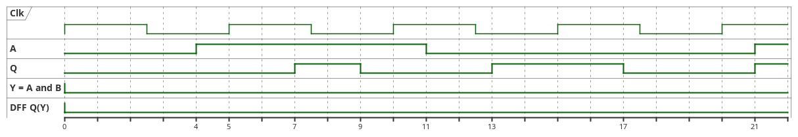

Imię: 
Nazwisko:

1. Wymień podstawowe bloki dostępne projektantowi FPGA 
(elementy składowe FPGA).

2. Uzupełnij tablicę prawdy dla komórki AND:

| In_A | in_B | Out |
|------|------|-----|
| 0    | 0    | 0   |
| 0    | 1    | 1   |
| 1    | 0    | 1   |
| 1    | 1    | 1   |

3. Na poniższym rysunku, jaki zmiany nastąpią 
na zboczach 1, 2, 3 zegara na wyjściu DFF(Q):

1: 0 -> ...
2: ... -> ...
3: ... -> ...

4. Wymień 3 lub więcej jednostki projektowe język VHDL

5. Wypisz deklarację jednostki entity komórki AND

6. (bonus) Wymień dodatkowe czynniki środowiskowe 
oddziaływające na układy FPGA w aplikacjach kosmicznych.
